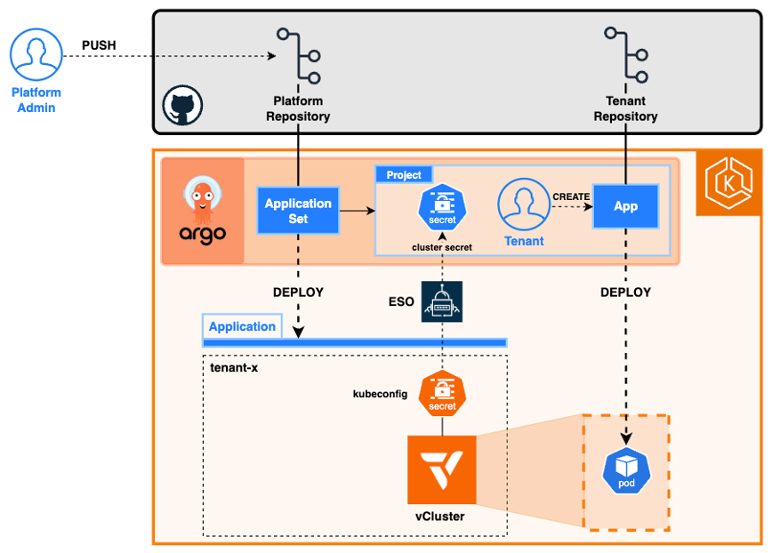

# CNDRO 26 - Zero-Trust Multi-Tenancy
### vCluster + Cilium Across Hybrid Cloud

A PoC for **multi-tenant Kubernetes platforms** using lightweight virtual clusters (vClusters), Cilium networking, and ArgoCD for GitOps orchestration.

**Conference Demo**: This project was created as a demonstration, showcasing practical patterns for tenant isolation, cross-cluster communication, and automated provisioning.

---

## 🎯 Project Overview

This repository demonstrates a **scalable multi-tenant Kubernetes environment** where:

- **Each tenant gets an isolated virtual Kubernetes cluster** (vCluster) running on a shared host cluster
- **Tenant isolation enforced** via Pod Security Admission, NetworkPolicies, resource quotas, and RBAC
- **Multi-cluster communication** enabled by Cilium service mesh DNS (cross-vCluster service discovery)
- **GitOps-driven provisioning** via ArgoCD ApplicationSets 
- **Credential security** using AWS Secrets Manager + External Secrets Operator (ESO)
- **Per-tenant control** with independent ArgoCD projects and local user accounts

**Architecture**: Host cluster runs multiple lightweight vClusters as StatefulSets. Each tenant gets:
- Isolated Kubernetes API server
- Independent etcd backend
- vCluster-scoped networking and RBAC
- Synced services to host for cross-cluster communication

---

## 📁 Repository Structure

```
cndro26-vcluster-cilium-poc/
│
├── README.md                                   # This file (repo overview)
│
├── code/                                       # Application source code
│   └── metrics-app/
│       ├── Dockerfile                         # Flask app container image
│       ├── requirements.txt                   # Python dependencies
│       └── src/
│           └── app.py                         # Flask app (metrics endpoints)
│
└── platform/                                  # Kubernetes manifests & Helm charts
    └── kubernetes/
        ├── README.md                          
        │
        ├── vcluster/                          # vCluster Bootstrap Chart
        │   ├── Chart.yaml
        │   ├── values.yaml                    # Tenant configuration template
        │   ├── vcluster-defaults.yaml         # Best-practice baseline values
        │   ├── templates/
        │   │   ├── vcluster.yaml              # Multi-source ArgoCD Application
        │   │   ├── appproject.yaml            # Per-tenant ArgoCD isolation
        │   │   ├── eso-secret.yaml            # Kubeconfig → ArgoCD bridge
        │   │   ├── cnp-health.yaml            # Cilium NetworkPolicy - allow kubelet health checks
        │   │   ├── cnp-scrape-mesh.yaml       # Cilium NetworkPolicy - allow metrics app access cross-cluster
        │   │   ├── cnp-scrape-auth.yaml       # Cilium NetworkPolicy - allow metrics app access forcing mAuth
        │   │   ├── cnp-scrape.yaml            # Cilium NetworkPolicy - allow metrics app access
        │   │   └── namespace.yaml
        │   └── README.md
        │
        ├── cnp/                              # CiliumNetworkPolicy Kustomize Overlays
        │   └── kustomize/
        │       ├── base/
        │       │   ├── cnp-health.yaml       # Allow kubelet health checks
        │       │   ├── cnp-scrape.yaml       # Allow metrics scraping
        │       │   └── kustomization.yaml
        │       ├── overlays/
        │       │   ├── vanilla/              # Default scenario (no ClusterMesh)
        │       │   ├── clustermesh/          # ClusterMesh enforcement (cluster ID label)
        │       │   └── mauth/                # mAuth / mutual TLS scenario
        │       └── README.md
        │
        ├── metrics/                           # Metrics App Chart
        │   ├── Chart.yaml
        │   ├── values.yaml
        │   ├── templates/
        │   │   ├── deploy.yaml                # Flask app Deployment
        │   │   ├── service.yaml
        │   │   └── namespace.yaml
        │   └── README.md
        │
        ├── scraper/                           # Metrics Scraper Chart
        │   ├── Chart.yaml
        │   ├── values.yaml
        │   ├── templates/
        │   │   ├── deploy.yaml
        │   │   └── namespace.yaml
        │   └── README.md
        │
        ├── argocd-tenant-rbac/                # Global Per-Tenant RBAC & Secrets
        │   ├── Chart.yaml
        │   ├── values.yaml
        │   ├── templates/
        │   │   ├── local-users.yaml           # ArgoCD user accounts
        │   │   ├── repository-secrets.yaml    # Git credentials (ESO)
        │   │   └── secretstore.yaml           # AWS Secrets Manager bridge
        │   └── README.md
        │
        ├── sample/                            # Reference App Template
        │   ├── Chart.yaml
        │   ├── values.yaml
        │   ├── templates/
        │   │   └── deploy.yaml                # nginx POC app
        │   └── README.md
        │
        ├── apps/                              # ArgoCD Applications & ApplicationSets
        │   ├── vcluster-tenants.yaml          # ApplicationSet: multi-tenant provisioning
        │   ├── metrics-app.yaml               # Application: metrics app in tenant-one
        │   ├── metrics-scraper.yaml           # Application: host cluster scraper
        │   ├── tenant-rbac.yaml               # Application: RBAC management
        │   └── README.md                      # Application orchestration guide
        │
        └── tenants/                           # Tenant Definitions (Source of Truth)
            ├── README.md                      # Tenant schema documentation
            └── tenants.yaml                   # Tenant list (drives ApplicationSet)
         

```

---

## 🚀 Quick Start

### Prerequisites

- **Kubernetes host cluster(s)** (v1.28+) with:
  - Cilium CNI installed (for cross-cluster DNS)
  - ArgoCD deployed (v2.10+)
  - External Secrets Operator (ESO) v0.9+
  - AWS Secrets Manager access (for credential storage)
- **Git repository** with this code (for ArgoCD Git source)
- **kubectl** configured to access host cluster
- **Helm** 3.0+ installed locally

### Deploy the Platform (5 Steps)

#### 1. **Setup ArgoCD**
```bash
# Create argocd namespace
kubectl create namespace argocd
kubectl apply -n argocd -f https://raw.githubusercontent.com/argoproj/argo-cd/stable/manifests/install.yaml

# Wait for ArgoCD server to be ready
kubectl wait -n argocd deployment/argocd-server --for=condition=available --timeout=5m
```

#### 2. **Configure AWS Secrets Manager Access**
```bash
# Create IAM ServiceAccount (uses IRSA - IAM Roles for Service Accounts)
# (Requires AWS CLI configured + EKS cluster with IRSA enabled)

# Store tenant credentials in AWS Secrets Manager
aws secretsmanager create-secret \
  --name /argocd/tenants/tenant-<name>/password \
  --secret-string "$(echo -n 'secure-password' | htpasswd -i)" \
  --region eu-central-1
```

#### 3. **Deploy ArgoCD Applications**
```bash
# Clone repository
git clone https://github.com/mario26rgl/cndro26-vcluster-cilium-poc.git
cd cndro26-vcluster-cilium-poc

# Create ApplicationSet (drives all deployments)
kubectl apply -f platform/kubernetes/apps/vcluster-tenants.yaml
kubectl apply -f platform/kubernetes/apps/metrics-app.yaml
kubectl apply -f platform/kubernetes/apps/metrics-scraper.yaml
kubectl apply -f platform/kubernetes/apps/tenant-rbac.yaml
```

#### 4. **Monitor Deployment**
```bash
# Watch ArgoCD Applications sync
argocd app list
argocd app watch tenant-one-bootstrap

# Monitor vCluster pod
kubectl get statefulset -n tenant-one
kubectl logs -n tenant-one deployment/tenant-one -f
```

#### 5. **Access vCluster**
```bash
# Get kubeconfig for tenant-one
kubectl get secret -n tenant-one vc-tenant-one -o jsonpath='{.data.kubeconfig}' | base64 -d > /tmp/tenant-one-kubeconfig

# Switch to tenant vCluster
export KUBECONFIG=/tmp/tenant-one-kubeconfig
kubectl get nodes
kubectl get pods -A
```

---

## 🏗️ Architecture

### High-Level Diagram

```

```

### Components & Interactions

| Component | Purpose | Deployment |
|---|---|---|
| **vCluster StatefulSet** | Lightweight Kubernetes cluster per tenant | Host cluster namespace |
| **Metrics App** | Flask HTTP service (CPU/memory endpoints) | Inside tenant vCluster |
| **Metrics Scraper** | Curl-based polling agent | Host cluster (platform-observability) |
| **ArgoCD ApplicationSet** | Auto-detects tenants, provisions resources | Host cluster (argocd namespace) |
| **AppProject** | Tenant isolation in ArgoCD | Host cluster (argocd namespace) |
| **ExternalSecret** | Bridges AWS Secrets → Kubernetes Secrets | Host cluster & tenant |
| **NetworkPolicy** | Cilium policies for cross-cluster traffic | Host cluster & vCluster |

---

## 📊 Data Flow Example

**Scenario**: Metrics scraper polls tenant-one's metrics app

```
1. Scraper pod executes curl:
   curl http://metrics-app-x-metrics-app-x-tenant-one.tenant-one:5000/metrics

2. Cilium DNS intercepts (service mesh):
   metrics-app-x-metrics-app-x-tenant-one.tenant-one
   ↓ resolves to ↓
   Service endpoint (synced from vCluster to host via sync policy)

3. NetworkPolicy allows traffic:
   Ingress from platform-observability → tenant-one namespace

4. vCluster routes to metrics-app pod:
   Inside tenant-one vCluster, service discovery resolves to pod IP

5. Flask app responds:
   {
     "cpu_usage_percent": 0.5,
     "memory_usage_percent": 3.2,
     "hostname": "metrics-app-abc123"
   }

6. Scraper logs result with timestamp
```

---

## 🔐 Security Architecture

### Tenant Isolation (Defense in Depth)

| Layer | Mechanism | Configuration |
|---|---|---|
| **Namespace** | vCluster namespace isolated from host | `metadata.namespace` in vcluster.yaml |
| **RBAC** | Separate RBAC policies per tenant | `appproject.yaml` in vcluster chart |
| **PSA** | Pod Security Admission (baseline/restricted) | `psa.config` in tenants.yaml |
| **NetworkPolicy** | Cilium policies restrict ingress/egress | `cnp-*.yaml` templates |
| **Resource Quota** | CPU/memory limits per vCluster | `vcluster_config.overrides` |
| **Credentials** | AWS Secrets Manager + ESO (no secrets in Git) | `repository-secrets.yaml` in RBAC chart |
| **Service Sync** | Selective service syncing to host | `sync.toHost` in vcluster-defaults.yaml |

---

## 📚 Detailed Documentation

Each chart and application has dedicated documentation:

### Helm Charts
- **[vcluster/README.md](platform/kubernetes/vcluster/README.md)** — Multi-tenant vCluster bootstrapping, ESO integration, sync policies
- **[metrics/README.md](platform/kubernetes/metrics/README.md)** — Flask metrics app, endpoints, container build
- **[scraper/README.md](platform/kubernetes/scraper/README.md)** — Cross-cluster scraper, DNS naming, troubleshooting
- **[argocd-tenant-rbac/README.md](platform/kubernetes/argocd-tenant-rbac/README.md)** — RBAC setup, credential security, AWS Secrets Manager
- **[sample/README.md](platform/kubernetes/sample/README.md)** — Reference template, customization, best practices

### Applications & Orchestration
- **[apps/README.md](platform/kubernetes/apps/README.md)** — ApplicationSet workflow, sync waves, multi-tenant provisioning, troubleshooting

### Cilium Network Policies
- **[cnp/kustomize/README.md](platform/kubernetes/cnp/kustomize/README.md)** — CiliumNetworkPolicy overlays (vanilla, ClusterMesh, mAuth), ArgoCD deployment

### Tenant Management
- **[tenants/README.md](platform/kubernetes/tenants/README.md)** — Tenant schema, configuration examples, adding new tenants

---

## 🛠️ Common Operations

### Add a New Tenant

1. **Edit tenant definition**:
   ```bash
   vim platform/kubernetes/tenants/tenants.yaml
   ```
   Add new tenant entry:
   ```yaml
   - name: tenant-two
     namespace: tenant-two
     project: tenant-two
     chartVersion: "0.33.1"
     # ... rest of config
   ```

2. **Commit and push**:
   ```bash
   git add platform/kubernetes/tenants/tenants.yaml
   git commit -m "Add tenant-two"
   git push
   ```

3. **Monitor deployment** (ApplicationSet auto-detects):
   ```bash
   argocd app list | grep tenant-two
   kubectl get statefulset -n tenant-two
   ```

### Deploy Application to Tenant

Create an ArgoCD Application targeting the vCluster:

```yaml
apiVersion: argoproj.io/v1alpha1
kind: Application
metadata:
  name: my-app
  namespace: argocd
spec:
  project: tenant-one  # Must match tenant project
  source:
    repoURL: https://github.com/mario26rgl/cndro26-vcluster-cilium-poc.git
    path: path/to/app
    helm: {}
  destination:
    server: "https://tenant-one.tenant-one"  # vCluster endpoint
    namespace: default
  syncPolicy:
    automated:
      prune: true
      selfHeal: true
```

### Deploy Cilium Network Policies to Tenant

CiliumNetworkPolicy overlays are managed separately via Kustomize. They can be deployed to the tenant space using the appropriate per-tenant value override.

**Example: Deploy vanilla CNPs for tenant-one**

```yaml
tenants:
- name: tenant-one
  namespace: tenant-one
  project: tenant-one
  cnp: vanilla
```

**Available scenarios**:
- `vanilla` — standard metrics app access
- `clustermesh` — ClusterMesh with cluster ID enforcement
- `mauth` — mAuth / mutual TLS scenario

See [cnp/kustomize/README.md](platform/kubernetes/cnp/kustomize/README.md) for more details.

### Monitor Metrics

```bash
# View scraper logs (cross-cluster polling)
kubectl logs -n platform-observability -f deployment/metrics-scraper

# Query metrics-app inside vCluster
kubectl exec -n metrics-app <pod> -- curl localhost:5000/metrics | jq .

# Port-forward and test locally
kubectl port-forward -n metrics-app svc/metrics-app 5000:5000
curl http://localhost:5000/metrics
```

### Verify Cross-Cluster Connectivity

```bash
# Test DNS resolution (Cilium)
kubectl run -it --rm debug --image=curlimages/curl --restart=Never -- \
  nslookup metrics-app-x-metrics-app-x-tenant-one.tenant-one

# Test HTTP connectivity
kubectl exec -n platform-observability <scraper-pod> -- \
  curl -v http://metrics-app-x-metrics-app-x-tenant-one.tenant-one:5000/health
```

---

## 🔍 Troubleshooting

### vCluster Pod Stuck in Pending

```bash
kubectl describe pod -n tenant-one <vcluster-pod>
# Check: PVC provisioner, resource quotas, node capacity
```

**Solution**: Verify PersistentVolume provisioner is available; reduce resource requests.

### Cross-Cluster Scraper Fails

```bash
kubectl logs -n platform-observability -f deployment/metrics-scraper
# Look for: Connection refused, DNS resolution failed, timeout
```

**Solution**: 
1. Check vCluster service sync enabled: `sync.toHost.services.enabled: true`
2. Verify Cilium DNS working: `kubectl get ciliumnetworkpolicies`
3. Check NetworkPolicy allows traffic: `kubectl get networkpolicies -n tenant-one`

### ArgoCD Application Won't Sync

```bash
argocd app get <app-name>
# Check: OutOfSync, Unknown error, missing resource
```

**Solution**:
1. Check Git source accessible
2. Verify Helm chart valid: `helm lint platform/kubernetes/<chart>`
3. Check destination cluster reachable: `argocd cluster list`

---

## 🎓 Learning Resources

### Key Concepts
- **[vCluster Documentation](https://www.vcluster.com/docs/)** — Virtual Kubernetes clusters
- **[Cilium Service Mesh](https://docs.cilium.io/en/stable/network/service-mesh/)** — Cross-cluster networking
- **[ArgoCD ApplicationSet](https://argocd-applicationset.readthedocs.io/)** — Multi-tenant provisioning patterns
- **[External Secrets Operator](https://external-secrets.io/)** — Credential management
- **[Pod Security Admission](https://kubernetes.io/docs/concepts/security/pod-security-admission/)** — Container isolation

---

## 📦 Building the Metrics App

The Flask metrics app is pre-built and published to Docker Hub (`mariorgl/cndro26-metrics`). To build locally:

```bash
cd code/metrics-app

# Build Docker image
docker build -t <your-registry>/metrics:amd64 .

# Test locally
docker run -it --rm -p 5000:5000 <your-registry>/metrics:amd64
curl http://localhost:5000/metrics

# Push to registry
docker push <your-registry>/metrics:amd64
```

Update image in [metrics/values.yaml](platform/kubernetes/metrics/values.yaml) to use your registry.

---

## 📝 License

This POC is provided as-is for educational and demonstration purposes. Adapt as needed for your use case.

**Happy deploying!** 🚀

